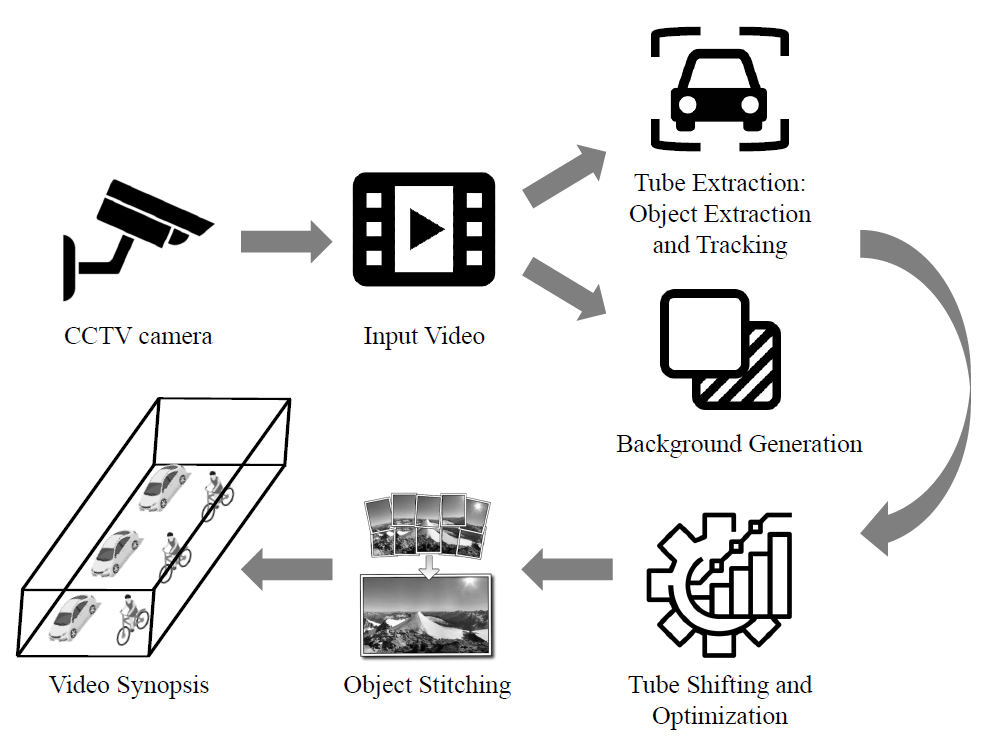

# Leveraging Video Synopsis for Road Traffic Footage

Reviewing and analyzing recorded surveillance footage for post-event video forensics is a labor-intensive, tedious yet sometimes necessary task. Surveillance personnel often have to go over hours of video footage in order to retrieve needed information that is usually sparsely distributed across the footage. Thus, there exists a need to effectively summarize surveillance footage and allow for the concise presentation of key events that occur throughout the video. The aim of this project is to provide a "video synopsis" tool for road traffic CCTV footage. Such a plug-in would interest entities that are looking for video analytics and forensic search solutions such as government agencies, shopping centers, and educational institutions.

## Features
This repository includes the scripts used in the main processes related to a video synopsis framework:
- **Instance Segmentation**: Mask R-CNN to segment instances of vehicles
- **Multi-Object Tracking**: simple centroid tracker
- **Background Generation**: Temporal median
- **Tube Shifting**: Basin Hopping with L-BFGS
- **Object Stitching**: Poisson image editing
- **Content Analysis**: Mobilenet classifiers trained on the [VeRi dataset](https://www.v7labs.com/open-datasets/veri-dataset). Tasks include type and color classification

